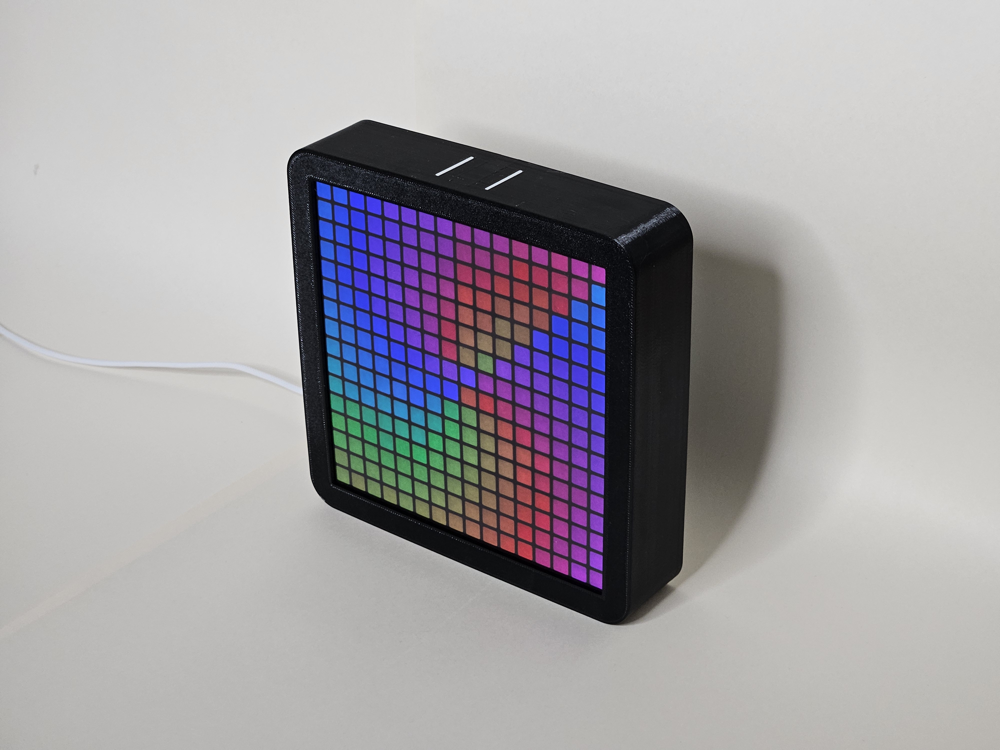

# The LightBox

## Introduction
RGB is always fun, especially when you can learn while using it! This repository contains the code and hardware documentation for the Lightbox, a project designed to enhance your understanding and enjoyment of electronics and programming. We hope this documentation will be helpful in your own projects.
Visit [nordic lightbox](https://nordiclightbox.com) for more information and download the documentation.

## First-Time Setup
1. Power Up the Lightbox: Plug in your Lightbox using the included USB cable and a power supply (minimum 15W recommended). The screen should light up with a red Wi-Fi symbol.
2. Connect to Access Point: Connect your mobile device to the Wi-Fi network named "My Lightbox wifi setup":
- Go to: Device settings → Wi-Fi settings → Connect to network.
3. Register Internet Credentials:
- Open a web browser and enter the address: http://192.168.4.1.
- On the page that appears, register your Wi-Fi name and password, then press "Register".
- The Wi-Fi symbol on the Lightbox should turn green. Please wait while the Lightbox starts up.
- Note: "Hostname" is the name you will use to access the Lightbox after setup.

## Basic Usage
### Controls
- Physical Button: Use the button to control the Lightbox:
  - Short Press: Cycle through different information displays.
  - Long Press: Hold for 5 seconds to enter sleep mode.
- Internet Connectivity: Remotely control the Lightbox over a network.
- Reset Button: Press and hold for 5 seconds to reset the Lightbox.

### Website Control
Control the Lightbox via the hosted website:

- Enter http://mylightbox (or the hostname you set up) in your browser.
    Note: This requires a working internet connection.
The website offers several sections:
- Preview and Customize: Use "Previous" and "Next" buttons to navigate, paint images, or upload your own.
- Matrix Settings: Change location, temperature units, and timezone offset. Press "Upload changes" to save.

## Hardware Setup
- Microcontroller: Raspberry Pi Pico W
  - Processor: Dual-core ARM Cortex M0
  - Flash Memory: 2MB
  - RAM: 264kB
  - Connectivity: Wireless (802.11n), Bluetooth 5.2
- LED Matrix: 16x16 WS2812b individually addressable RGB LEDs
    - Voltage: 5V
    - Power Consumption: ~0.3W per LED
- Lightbox Power Consumption: Minimum 15W power supply recommended

## Software

### 1. Structure
The Lightbox software contains the following files and folders:

- data/: Setup data such as location, temperature units, etc.
- figures/: Default figures (emojis, weather symbols) in PPM P3 format.
- images/: Stores images uploaded through the website.
- lib/: Libraries essential for different functionalities.
- web/: HTML documents provided by the local server.
- events.py: Controls the event loop and displayed images.
- main.py: Main script where the program starts.
- weather.py: Stores current weather data.

### 2. Coding Setup (IDE)
We recommend using Thonny for programming the Lightbox.

1. Download and install Thonny.
2. Connect the Lightbox to your computer via USB and open Thonny. Ensure Thonny detects the board.

For further information, see:
- [Getting Started with the Pico](https://projects.raspberrypi.org/en/projects/getting-started-with-the-pico/2)
- [Raspberry Pi Pico Documentation (Chapter 4)](https://www.raspberrypi.com/documentation/microcontrollers/pico-series.html)
  
Other IDEs such as Visual Studio Code are also viable options.

### 3. How to Display Content
To display content, use methods corresponding to the my_lightbox object, primarily defined in rgb_matrix.py in the lib folder.

Useful methods:

- .set_pixel_color(x, y, color): Set a pixel to a selected color.
- .clear(): Clears the image buffer.
- .show(): Displays the content in the image buffer.
- show_text(text, color, y, delay=0.075, run_times=-1): Displays scrolling text.

### 4. Adding a Custom Event
To add a custom event:

1. Open events.py and add a new elif statement for the desired button count.
2. Use the show_text() method to display custom text.
3. Increase the maximum button count at the top of the file.
4. Save the file, unplug and replug the Lightbox to apply changes.

## Disclaimer
The information provided in this documentation is for educational purposes only. The Lightbox product, software, and associated documentation are provided "as is," without any warranty. The authors and publishers are not liable for any loss or damage resulting from the use of the Lightbox or its documentation.

For further assistance or questions, please contact our support team: help@nordiclightbox.com

